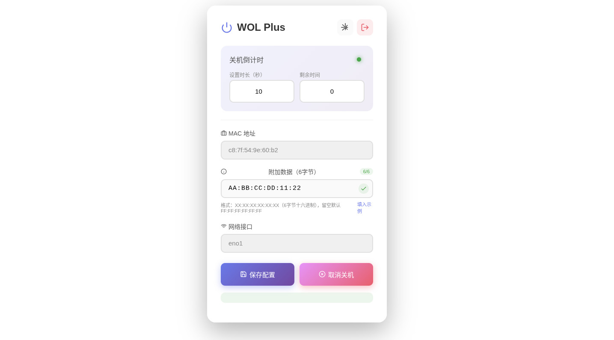

# Wake On LAN Plus

> 通过标准 Wake-on-LAN 唤醒设备，并通过带 6 字节附加数据的 WOL-plus 数据包远程关机。

[](https://opensource.org/licenses/MIT)

Wake On LAN Plus 由两部分组成：

- OpenWrt 端：发送端，集成到 LuCI，用来发送唤醒包和关机包
- Client 端：接收端，运行在 Windows 或 Linux 上，接收关机包并提供 Web UI 配置页面

如果你只想尽快用起来，建议按这个顺序：

1. 从 [Releases](https://github.com/leeyeel/WOL-plus/releases) 下载 OpenWrt 端和 Client 端安装包
2. 在目标电脑上先安装 Client 端
3. 打开 Client Web UI，设置 `extra_data`、UDP 端口和关机倒计时
4. 在 OpenWrt 的 LuCI 页面里填入同样的 `extra_data` 和目标设备 MAC
5. 测试唤醒和关机

## 适用场景

- 唤醒局域网内支持 WOL 的设备
- 通过 OpenWrt 路由器统一发送唤醒/关机命令
- 在 Windows、Debian/Ubuntu、RPM 系 Linux 上部署接收端
- 使用仓库内 skill 从命令行或 agent 环境发送唤醒/关机包

## 界面预览

### OpenWrt 端


### Client 端 Web UI



## Releases 下载说明

所有可直接安装的产物都在 [Releases](https://github.com/leeyeel/WOL-plus/releases) 页面提供下载。

常见文件名如下：

- OpenWrt 主包：
  - `luci-app-wolp_<version>_x86_64.ipk`
  - `luci-app-wolp_<version>_aarch64_generic.ipk`
- OpenWrt 简体中文包：
  - `luci-i18n-wolp-zh-cn_<version>_x86_64.ipk`
  - `luci-i18n-wolp-zh-cn_<version>_aarch64_generic.ipk`
- Windows Client：
  - `installer_windows_amd64_v<version>.exe`
- Debian/Ubuntu Client：
  - `wolp-client_<version>_amd64.deb`
  - `wolp-client_<version>_arm64.deb`
- RPM Client：
  - `wolp-client-<version>-1.x86_64.rpm`
  - `wolp-client-<version>-1.aarch64.rpm`

## OpenWrt 端安装与使用

OpenWrt 端是发送端，安装后会出现在 LuCI 的“服务”菜单中。

### 安装

如果系统里已经装了官方 `luci-app-wol`，建议先卸载，避免菜单和功能冲突：

```bash
opkg remove luci-app-wol
```

下载与你设备架构对应的 IPK 包后，上传到路由器并安装：

```bash
scp luci-app-wolp_<version>_<arch>.ipk root@<openwrt-ip>:/tmp/
scp luci-i18n-wolp-zh-cn_<version>_<arch>.ipk root@<openwrt-ip>:/tmp/

ssh root@<openwrt-ip>
opkg update
opkg install /tmp/luci-app-wolp_<version>_<arch>.ipk
opkg install /tmp/luci-i18n-wolp-zh-cn_<version>_<arch>.ipk
```

也可以直接通过LuCI安装软件包:

```
系统-> 软件包 -> 更新列表 -> 上传软件包
```

安装完成后，在 LuCI 中进入：

`服务 -> Wake on LAN+`

### 使用

在 OpenWrt 页面中主要需要填写：

- 目标设备 MAC 地址
- 关机附加数据 `extra_data`
- 关机 UDP 端口，默认 `9`

说明：

- 唤醒使用标准 WOL Magic Packet
- 关机使用 WOL-plus 包，格式为 `FF*6 + MAC*16 + extra_data(6字节)`
- `extra_data` 必须与 Client 端配置完全一致

## Client 端安装与使用

Client 端负责接收关机包，并提供 Web UI 配置页面。

默认 Web UI 地址：

- `http://<client-ip>:2025`

默认登录信息：

- 用户名：`admin`
- 密码：`admin123`

首次登录后建议立即修改密码。

### Windows 安装

从 Releases 下载：

- `installer_windows_amd64_v<version>.exe`

安装步骤：

1. 直接运行安装程序
2. 安装完成后服务会自动启动
3. 浏览器访问 `http://<windows-ip>:2025`

### Debian / Ubuntu 安装

从 Releases 下载对应架构的 `.deb` 包后安装：

```bash
sudo dpkg -i wolp-client_<version>_amd64.deb
sudo systemctl status wolp.service
```

### RPM 系 Linux 安装

从 Releases 下载对应架构的 `.rpm` 包后安装：

```bash
sudo rpm -ivh wolp-client-<version>-1.x86_64.rpm
sudo systemctl status wolp.service
```

### Linux 安装后的文件位置

Linux Client 默认路径如下：

- 可执行文件：`/usr/local/bin/wolp`
- 配置文件：`/usr/local/etc/wolp/wolp.json`
- Web UI：`/usr/share/wolp/webui`
- systemd 服务：`wolp.service`

### Client 端 Web UI 配置

Client 端重点配置项：

- `extra_data`
  - 必须与 OpenWrt 端保持一致
- `udp_port`
  - 默认 `9`
  - 必须与 OpenWrt 端保持一致
- `shutdown_delay`
  - 收到合法关机包后延迟多少秒执行关机
- `username` / `password`
  - Web UI 登录凭据

仓库里的默认配置值是：

- `extra_data = FF:FF:FF:FF:FF:FF`
- `udp_port = 9`
- `shutdown_delay = 60`

## 推荐使用流程

### 1. 先安装 Client 端

先在目标电脑上安装 Windows、Debian/Ubuntu 或 RPM 包。

### 2. 打开 Client Web UI

访问：

- `http://<client-ip>:2025`

记录并确认这些值：

- 目标设备 MAC 地址
- `extra_data`
- `udp_port`

### 3. 在 OpenWrt 端填写同样的参数

在 LuCI 页面中配置：

- 目标 MAC 地址
- `extra_data`
- `udp_port`

### 4. 测试唤醒和关机

建议先测试唤醒，再测试关机。

如果关机没有生效，优先检查：

- OpenWrt 和目标机器是否互通
- Client 端服务是否运行正常
- `extra_data` 是否完全一致
- `udp_port` 是否完全一致
- 目标机器防火墙是否拦截 UDP

## Skill 使用

仓库内提供了一个 skill：

- `skill/wolp-lan-power-control`

它适合以下场景：

- 从命令行快速发送唤醒包
- 从命令行快速发送 WOL-plus 关机包
- 在 agent/自动化环境中复用设备清单

skill 入口脚本：

- `skill/wolp-lan-power-control/scripts/wolp_power.py`

设备清单文件：

- `skill/wolp-lan-power-control/assets/devices.json`

### 安装依赖

`wake` 子命令依赖 `wakeonlan`：

```bash
python3 -m pip install wakeonlan
```

### 直接使用命令

查看设备清单：

```bash
python3 skill/wolp-lan-power-control/scripts/wolp_power.py list
```

发送唤醒包：

```bash
python3 skill/wolp-lan-power-control/scripts/wolp_power.py wake --mac AA:BB:CC:DD:EE:FF
```

指定广播地址发送唤醒包：

```bash
python3 skill/wolp-lan-power-control/scripts/wolp_power.py wake --mac AA:BB:CC:DD:EE:FF --broadcast-ip 192.168.1.255 --port 9
```

发送关机包：

```bash
python3 skill/wolp-lan-power-control/scripts/wolp_power.py shutdown --host 192.168.1.50 --mac AA:BB:CC:DD:EE:FF --extra-data FF:FF:FF:FF:FF:FF --port 9
```

仅预览、不实际发送：

```bash
python3 skill/wolp-lan-power-control/scripts/wolp_power.py wake --mac AA:BB:CC:DD:EE:FF --dry-run
python3 skill/wolp-lan-power-control/scripts/wolp_power.py shutdown --host 192.168.1.50 --mac AA:BB:CC:DD:EE:FF --dry-run
```

### 使用设备清单

`devices.json` 里可以保存常用设备，例如：

```json
{
  "defaults": {
    "broadcast_ip": "255.255.255.255",
    "port": 9,
    "extra_data": "FF:FF:FF:FF:FF:FF"
  },
  "devices": {
    "nas": {
      "mac": "AA:BB:CC:DD:EE:FF",
      "host": "192.168.1.50",
      "broadcast_ip": "192.168.1.255",
      "last_action": "wake",
      "last_success_at": "2026-03-21T00:00:00Z"
    }
  }
}
```

实际发送成功后，脚本也会自动把当前解析出的设备信息写回 `devices.json`：

- 指定了 `--device <name>` 时，更新对应条目
- 未指定 `--device` 时，优先按相同 MAC 复用已有条目；否则自动创建 `device-<mac>` 条目
- 同一设备多次 `wake/shutdown` 会持续刷新该设备的最新字段和成功时间

然后就可以直接按名称发送：

```bash
python3 skill/wolp-lan-power-control/scripts/wolp_power.py wake --device nas
python3 skill/wolp-lan-power-control/scripts/wolp_power.py shutdown --device nas
```

## 工作原理

唤醒：

- OpenWrt 或 skill 发送标准 Wake-on-LAN Magic Packet

关机：

- OpenWrt 或 skill 发送带 6 字节 `extra_data` 的 WOL-plus UDP 包
- Client 端收到后校验：
  - 目标 MAC 是否匹配
  - `extra_data` 是否匹配
  - UDP 端口是否匹配
- 校验通过后，Client 端进入关机倒计时

## 许可证

[MIT License](LICENSE)
