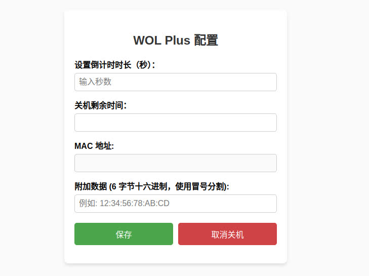

# Wake On LAN Plus 既可唤醒，又可关机

openwrt 端展示:


客户端展示:



### 使用警告

使用了etherwake来发送数据包，所以关机与唤醒都使用了WOL数据包

如果第一次发送数据包，设备关机完毕，此时再次发送关机数据包，

此数据包会被当作唤醒数据包唤醒设备。

[WOL原项目](https://github.com/openwrt/luci/tree/master/applications/luci-app-wol)

### 安装及使用方法

**如果你的openwrt中已经安装了wol，请先卸载**

1. openwrt端安装

注意替换ip为openwrt的ip, 拷贝 wol.zh-cn.lom文件到openwrt的/usr/lib/lua/luci/i18n/目录

下载项目:

```
git clone https://github.com/leeyeel/WOL-plus.git

cd WOL-plus
```

使用scp或者自己喜欢的方式拷贝文件到指定目录。

拷贝 wol.js文件到openwrt的/www/luci-static/resources/view/目录
```
scp -O openwrt/wol.js root@[ip]:/www/luci-static/resources/view/
```

拷贝中文翻译
```
scp -O openwrt/wol.zh-cn.lmo root@[ip]:/usr/lib/lua/luci/i18n/ 
```

2. 客户端安装
    - windows
        访问[releases](https://github.com/leeyeel/WOL-plus/releases),下载`installer_windows_inno_x64.exe`
        后直接安装即可。
    - linux/macos
        编译安装。
        ```
        cd WOL-plus
        make
        sudo make install
        ```
### 开发指南

1. luci-app-wol源代码

如果想自己编译openwrt可直接替换文件即可

[luci-app-wol原项目地址](https://github.com/openwrt/luci/tree/master/applications/luci-app-wol)

替换当前目录下openwrt/wol.js到luci-app-wol/htdocs/luci-static/resources/view/
替换当前目录下openwrt/wol.po到luci-app-wol/po/zh_Hans

2. wol.po文本文件转wol.lmo二进制文件

需要使用po2lmo转换，如果没有，需要自己编译

```
git clone https://github.com/openwrt/luci.git
cd luci/modules/luci-base
make po2lmo
```

便已完成po2lmo后使用`po2lmo wol.po wol.lmo`即可完成转换。

### TODO

- web增加取消关机功能
- 增加倒计时关机提醒
- 增加修改端口功能 


